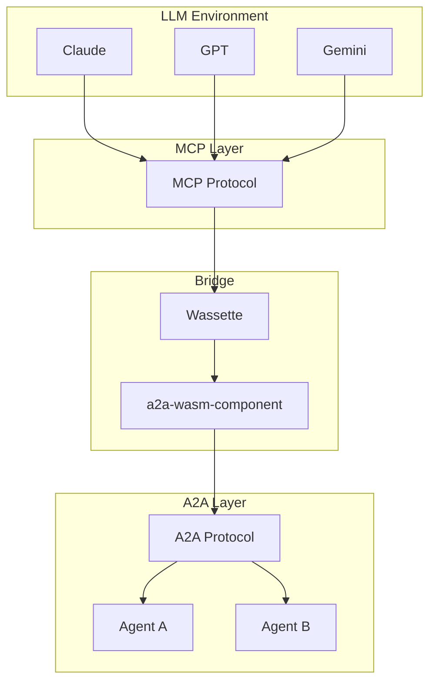
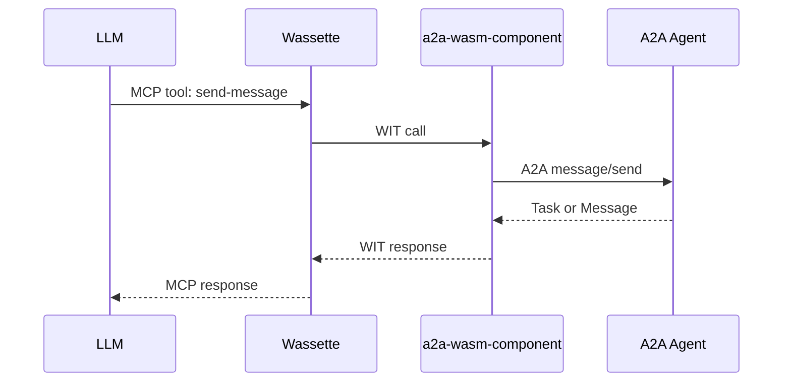

# a2a-rust

A Rust implementation of the [A2A (Agent-to-Agent) protocol](https://google.github.io/A2A/) for standardized AI agent communication over HTTP REST, JSON-RPC and MCP.

> ⚠️ **Alpha Software**: This project is in early development. APIs are unstable and may change without notice. Not recommended for production use.

## Overview

a2a-rust provides a complete toolkit for building A2A-compatible agents in Rust:

- **Type-safe protocol implementation** - All A2A types with full serde support
- **Flexible client** - Call remote agents with automatic protocol negotiation
- **Server framework** - Build agents that handle A2A requests
- **WebAssembly support** - Run agents as WASM components using the Component Model

### MCP + A2A: Connect LLMs to Agent Ecosystems

The WASM component can be deployed with [Wassette](https://github.com/microsoft/wassette) to expose A2A as an MCP server. This enables LLMs with MCP support (Claude, etc.) to discover and interact with any A2A-compatible agent—bridging the Model Context Protocol and Agent-to-Agent worlds.

**Architecture layers:**



**Request flow:**



## Architecture

The library is organized as a Cargo workspace with six crates:

```
a2a-rust/
├── a2a-types          # Core protocol types (Task, Message, AgentCard, etc.)
├── a2a-transport      # Abstract HTTP transport traits
├── a2a-transport-wasi # WASI HTTP transport implementation
├── a2a-client         # A2A client with protocol negotiation
├── a2a-server         # Server framework with AgentHandler trait
└── a2a-wasm-component # WASM Component Model package
```

### Crate Responsibilities

| Crate | Purpose |
|-------|---------|
| `a2a-types` | Protocol types generated from protobuf. Use this for type definitions only. |
| `a2a-transport` | `HttpClient` and `HttpServer` traits. Implement these for your runtime. |
| `a2a-transport-wasi` | Transport implementation for WASI environments. |
| `a2a-client` | High-level client with agent discovery, binding negotiation, and task management. |
| `a2a-server` | `AgentHandler` trait for implementing agent logic, plus `TaskStore` for persistence. |
| `a2a-wasm-component` | Ready-to-deploy WASM component exporting `wasi:http/incoming-handler`. |

### Design Principles

- **Transport-agnostic**: Core logic is decoupled from HTTP implementation
- **Async-first**: Built on `futures-core` for runtime flexibility
- **Protocol negotiation**: Clients automatically discover and use optimal bindings

## Usage

### Sending a Message to an Agent

```rust
use a2a_client::A2aClient;
use a2a_types::{Message, Part, TextPart};

// Create a client from an agent's card URL
let client = A2aClient::builder()
    .agent_card_url("https://example.com/.well-known/agent-card.json")
    .build()
    .await?;

// Send a message
let message = Message {
    parts: vec![Part::Text(TextPart {
        text: "Hello, agent!".into(),
        ..Default::default()
    })],
    ..Default::default()
};

let task = client.send_message(message).await?;
println!("Task state: {:?}", task.state);
```

### Implementing an Agent Handler

```rust
use a2a_server::{AgentHandler, TaskStore, InMemoryTaskStore};
use a2a_types::{Task, Message};

struct MyAgent;

impl AgentHandler for MyAgent {
    async fn handle_message(&self, message: Message) -> Result<Task, Error> {
        // Process the message and return a task
        todo!()
    }
}
```

## WebAssembly Component

The `a2a-wasm-component` crate produces a WASM component targeting `wasm32-wasip2`. It exports the standard `wasi:http/incoming-handler` interface, making it deployable on any WASM-compatible runtime.

### Building

```bash
cargo build -p a2a-wasm-component --target wasm32-wasip2 --release
```

### Deploying with Wassette (MCP Bridge)

[Wassette](https://github.com/microsoft/wassette) can host the WASM component as an MCP server, allowing LLMs to interact with A2A agents:

```bash
wassette serve target/wasm32-wasip2/release/a2a_wasm_component.wasm
```

This exposes A2A operations as MCP tools, enabling Claude and other MCP-compatible LLMs to:
- Discover agents via their agent cards
- Send messages and manage tasks
- Receive responses from any A2A-compatible agent

### Supported Features

The WASM component currently supports:
- JSON-RPC and REST protocol bindings
- Agent card discovery (`/.well-known/agent-card.json`)
- Text message parts (FilePart and DataPart coming soon)

## Contributing

Contributions are welcome! This project is in active development and there's plenty to do.

### Development Setup

```bash
git clone https://gitlab.com/lx-industries/a2a-rust.git
cd a2a-rust
cargo build
cargo test
```

### Running WASM Integration Tests

```bash
cargo test -p a2a-wasm-component
```

The integration tests use a Python A2A server fixture—ensure Python 3 and the `a2a` package are available.

### Areas for Contribution

- FilePart and DataPart support in WASM component
- Additional transport implementations
- Documentation and examples
- Protocol conformance testing

## License

MIT
